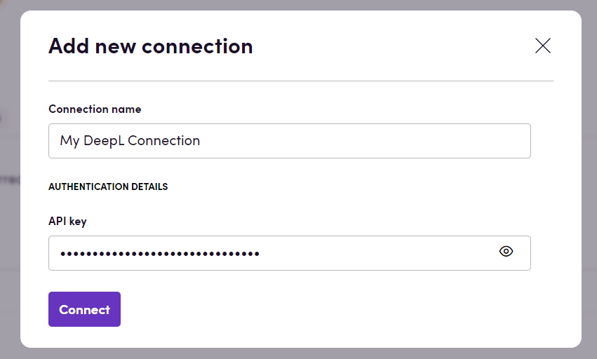
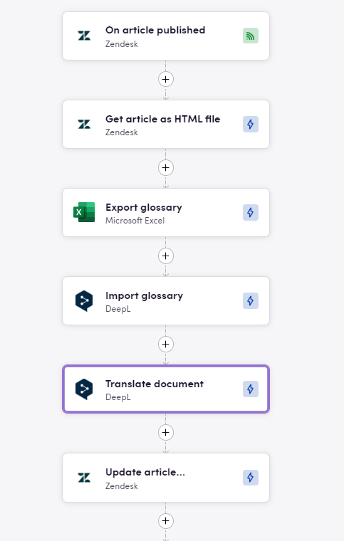

# Blackbird.io DeepL

Blackbird is the new automation backbone for the language technology industry. Blackbird provides enterprise-scale automation and orchestration with a simple no-code/low-code platform. Blackbird enables ambitious organizations to identify, vet and automate as many processes as possible. Not just localization workflows, but any business and IT process. This repository represents an application that is deployable on Blackbird and usable inside the workflow editor.

## Introduction

<!-- begin docs -->

DeepL is an artificial intelligence (AI) company that specializes in language translation services. It offers a neural machine translation (NMT) engine capable of providing high-quality translations across multiple languages. DeepL's translation engine is known for its accuracy, natural-sounding translations, and ability to understand context.

## Before setting up

Before you can connect you need to make sure that:

- You have a DeepL account.
- You have an API key for your DeepL account. It can be found under _account settings_ in DeepL.

## Connecting

1. Navigate to apps and search for DeepL. If you cannot find DeepL then click _Add App_ in the top right corner, select DeepL and add the app to your Blackbird environment.
2. Click _Add Connection_.
3. Name your connection for future reference e.g. 'My DeepL connection'.
4. Fill in the API key to your DeepL account.
7. Click _Connect_.

## Actions

### Translation 

- **Translate** Translate text
- **Translate document** Translate a document

### Glossaries 

- **Export glossary** Export glossary
- **Import glossary** Import glossary

## Example

The example above shows a bird that is triggered as soon as an article is published in Zendesk, said article is then exported as an HTML document and translated through DeepL before being imported back into Zendesk. The DeepL translation also considers as guardrail a Glossary that has been exported from Microsoft Excel.

## Feedback

Do you want to use this app or do you have feedback on our implementation? Reach out to us using the [established channels](https://www.blackbird.io/) or create an issue.

<!-- end docs -->
 
