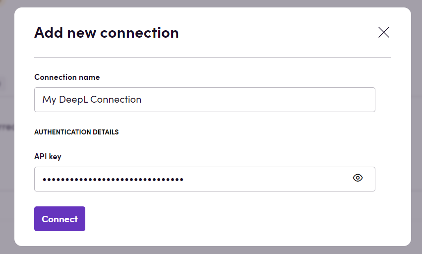
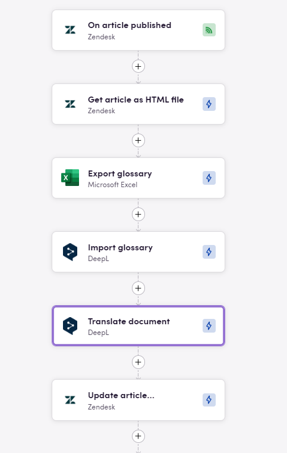

# Blackbird.io DeepL

Blackbird is the new automation backbone for the language technology industry.
Blackbird provides enterprise-scale automation and orchestration with a simple
no-code/low-code platform. Blackbird enables ambitious organizations to
identify, vet and automate as many processes as possible. Not just localization
workflows, but any business and IT process. This repository represents an
application that is deployable on Blackbird and usable inside the workflow
editor.

## Introduction

<!-- begin docs -->

DeepL is an artificial intelligence (AI) company that specializes in language
translation services. It offers a neural machine translation (NMT) engine
capable of providing high-quality translations across multiple languages.
DeepL's translation engine is known for its accuracy, natural-sounding
translations, and ability to understand context.

## Before setting up

Before you can connect you need to make sure that:

- You have a DeepL account.
- You have an API key for your DeepL account. It can be found under _account
  settings_ in DeepL.
- **Important**: If you are using an API key for CAT tools, it will not work for
  the public API. Instead, you need to use the Authentication key for DeepL API.
  You can find [guidance](https://youtu.be/WTt3UuiDAf4?t=79) on where it is
  located in this guide. For more details, you can also refer to this
  [discussion](https://github.com/DeepLcom/deepl-python/issues/106), where a
  similar issue was resolved.

## Connecting

1. Navigate to Apps, and identify the DeepL app. You can use search to find it.
2. Click _Add Connection_.
3. Name your connection for future reference e.g. 'My DeepL connection'.
4. Fill in the API key to your DeepL account.
5. Click _Connect_.

## Actions

### Translation

- **Translate text** Translate text using DeepL. Outputs translated text, detected source language, and billed characters. Advanced settings:
  - **Source language**: Set the original language when you do not want automatic detection.
  - **Formality**: Control how formal the output text should be when supported.
  - **Glossary**: Apply a glossary to enforce preferred terminology.
  - **Style rules**: Apply a style rule to guide phrasing in the output.
  - **Tag handling**: Control how tags are interpreted during translation.
  - **Model type**: Choose the DeepL model behavior for the translation.
  - **Preserve formatting**: Keep formatting in the output text.
  - **Outline detection**: Preserve outline structure in tagged content.
  - **Non-splitting tags**: Provide tags that must stay intact.
  - **Splitting tags**: Provide tags that may be split.
  - **Ignore tags**: Provide tags that should not be translated.
  - **Context**: Add extra context to improve output quality.
- **Translate** Translate a file using DeepL and output the translated file for downstream actions. Supports glossary, style rules, and output file settings. Advanced settings:
  - **Glossary ID**: Apply a specific glossary by ID.
  - **Output file handling**: Choose whether the output stays interoperable or follows original format handling.
  - **File translation strategy**: Choose DeepL native file handling or Blackbird interoperability mode.

### Write

- **Improve text** Rewrite text with DeepL Write and output improved text with language information. Advanced settings:
  - **Language**: Set the output language variant for the rewrite.
  - **Writing style**: Choose the writing style for the rewritten text.
  - **Tone**: Choose the tone for the rewritten text.

### Glossaries

**Note**: DeepL supports only two-letter base locale codes for glossaries (e.g., `fr` instead of `fr-FR`). The app automatically normalizes all language codes to their two-letter form. If multiple locales with different region codes are provided (e.g., `se-sv` and `se-fi`), the first one will be used and the rest will be ignored. Unfortunately, this is a limitation of the DeepL API.

- **Export glossary** Export a selected glossary as a TBX file.
- **Import glossary** Import a bilingual glossary file (TBX, CSV, or TSV) and create a DeepL glossary. Advanced settings:
  - **New glossary name**: Override the glossary name from the imported file.
- **Get glossary details** Get metadata for a selected glossary.
- **Get glossary entries** Download entries from a selected glossary as a TSV file.
- **Search glossaries** Search all available glossaries.
- **Delete glossary** Delete a selected glossary.
- **Import glossary (multilingual)** Import a multilingual glossary file and create a DeepL v3 glossary with multiple language pairs.
- **Update dictionary (multilingual)** Update dictionaries in an existing multilingual glossary from a TBX, CSV, or TSV file.
- **Export glossary (multilingual)** Export a multilingual glossary as a TBX file.
- **Export glossary (new)** Export a glossary as TBX v3 or TBX v2. Advanced settings:
  - **TBX export version**: Choose whether the export file is TBX v3 or TBX v2.
- **Import glossary (new)** Import TBX/CSV/TSV glossary files (bilingual or multilingual) into a DeepL v3 glossary. Advanced settings:
  - **Name**: Set a custom name for the new glossary.
  - **Pivot language code**: Set the pivot language used for multilingual import.
  - **Source language code**: Set a specific source language code.
  - **Target language code**: Set a specific target language code.
  - **Force header row (CSV/TSV)**: Force CSV/TSV parsing to treat the first row as a header.
## Example

The example above shows a bird that is triggered as soon as an article is
published in Zendesk, said article is then exported as an HTML document and
translated through DeepL before being imported back into Zendesk. The DeepL
translation also considers as guardrail a Glossary that has been exported from
Microsoft Excel.

## Feedback

Do you want to use this app or do you have feedback on our implementation? Reach
out to us using the [established channels](https://www.blackbird.io/) or create
an issue.

<!-- end docs -->

